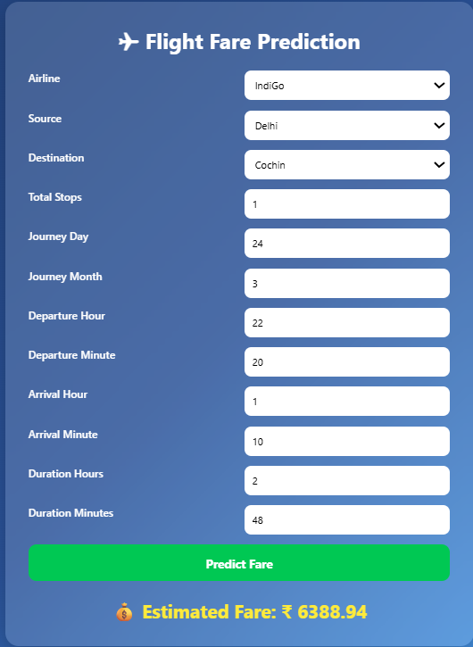

\# ✈️ Flight Fare Prediction

\## 📌 Project Overview

This project is a Machine Learning model that predicts flight ticket prices based on various features like airline, source, destination, duration, stops, and date-related information.

The goal is to help users estimate flight fares before booking.

\---

\## 🚀 Features

\- Data preprocessing and feature engineering

\- Model training using Machine Learning algorithms

\- Web interface using Flask (if applicable)

\- Prediction of flight ticket prices

\---

\## 🧠 Technologies Used

\- Python

\- Pandas, NumPy

\- Scikit-learn

\- Matplotlib / Seaborn

\- Flask (for web app)

\- Jupyter Notebook

\## 📁 Project Structure

FLIGHT-FARE-PREDICTION/

│

├── app.py

├── Data\_Train.csv

├── Test\_set.csv

├── Flight Fare Prediction.ipynb

├── templates/

├── static/

├── .gitignore

└── README.md

\---

\##  How to Run This Project

\### 1. Clone the repository

git clone https://github.com/u2403169-oss/FLIGHT-FARE-PREDICTION.git

\### 2. Install dependencies

pip install -r requirements.txt

\### 3. Run the app

\---

\## 📊 Model Details

\- Data cleaned and preprocessed

\- Feature engineering applied

\- Model trained to predict flight prices

\---

\## 🎯 Future Improvements

\- Improve model accuracy

\- Add more features (weather, airline ratings)

\- Deploy on cloud (Render / AWS / Streamlit)

\## Project screenshot
   

\## 👨‍💻 Author

\- JYOTHIKA RAJ

